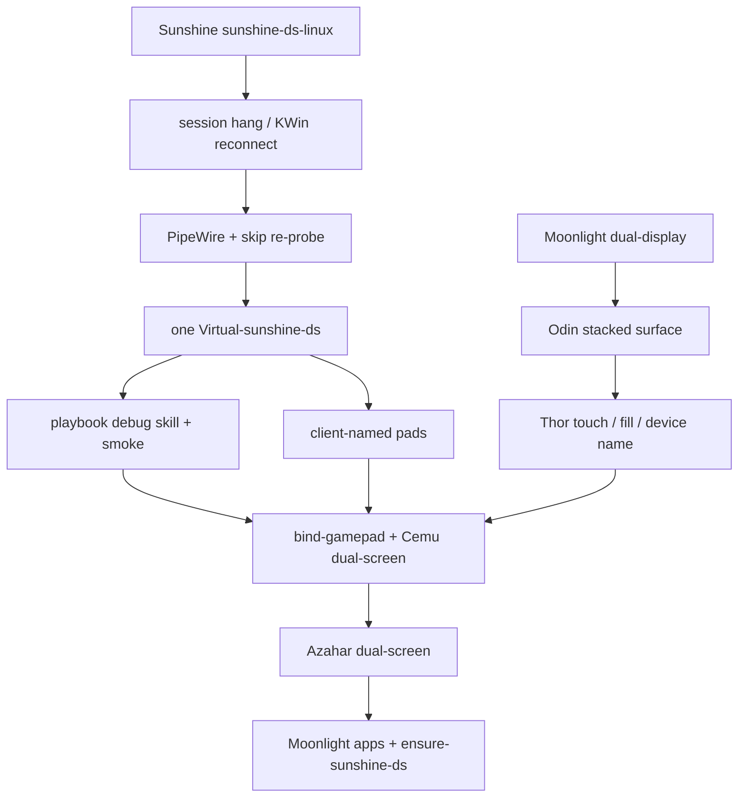

# sunshine-ds checkpoint and stack

Proven dual-stream GameStream as of 2026-09-08. Personal IPs/uniqueids stay in `host.md` / `rules_of_the_land.md`.

## Game Mode dual-stream + overlay + screensaver + Thor pad (2026-09-10, user confirmed)

User: “it works!” (earlier: both screens, Steam overlay, bottom screensaver; then Thor bumpers/Select). Do not “improve” this unless it breaks. Daily Plasma dual-screen stays `:48100`. Do **not** merge kms into play / `:48100`. Recipe: `.cursor/skills/sunshine-ds-gamemode/SKILL.md`.

| Item | Proven value |
|---|---|
| Tag | **`checkpoint-2026-09-10-gamemode-tender-ds`** (prefer: Tender Play auto dual-screen + Exit paints clock + Cemu audio). Earlier: `checkpoint-2026-09-10-gamemode-cemu-audio` (manual script only). Full Thor minus audio: `checkpoint-2026-09-10-gamemode-works`. Screens-only: `checkpoint-2026-09-10-gamemode-dual-stream` |
| [FanGoH/Sunshine](https://github.com/FanGoH/Sunshine) | `cursor/pw-link-gamescope-f15e` tip **`9e07d39e`** (AUTOCONNECT + object.serial; do not ship `f8d9968c` skip-AUTOCONNECT) |
| This playbook | this tree / same tag |
| [FanGoH/moonlight-android](https://github.com/FanGoH/moonlight-android) | `dual-display` `87267c9a` (unchanged) |
| Host ELF | `~/.local/bin/sunshine-ds-kms` sha `620e6aef…`, `cap_sys_admin=ep`, RUNPATH `~/.local/lib/sunshine-ds-kms`. Live pid may still be the `f8d9968c` skip build — sidecar must not write `node=` |
| Sidecar | `$XDG_RUNTIME_DIR/sunshine-ds-gamemode-virtual`: `serial=` + **`pw_node=`** (not `node=`). `f8d9968c` skips AUTOCONNECT when `node=` is set |
| Conf | `capture = kms`, `output_name = HDMI-A-1`, `dual_display_source = gamescope-virtual`, `port = 48200`, `encoder = software`, `gamepad = x360`, `back_button_timeout = 500`, `audio_sink` = HDMI alsa leaf (Steam UI + VSS mix; not VSS.monitor, not `sink-sunshine-stereo`) |
| Moonlight | host **`:48200`** uniqueid `1075C8EF…`. Desktop app **`958645192`**. Not `881448767`, not Decky `:47989`, not `:48100` |
| Idle bottom | `scripts/sunshine-ds-bottom-screensaver.py` on `:2` (clock + moving bar). `--paint` after Cemu/ffplay exit |
| Cemu | Tender Play while `:48200` BUSY + virtual sidecar → `CEMU_GAMEMODE_DS=1` + `--attach` (**no** `-f`). Manual: `CEMU_PAD_MATCH=Thor ./scripts/ensure-cemu-gamemode-dual-screen.sh`. TV on session `:1` (1920×1080 InputOutput, `------- Init Cemu`). GamePad `ffplay -window_id` onto `:2`. Exit: kill leftover x11grab then `--paint` |
| Overlay | Hold Select 0.5s. sunshine-ds sets `STEAM_OVERLAY=1` on BPM + `FOCUSED_APP=769` (`:0`). Hide restores Cemu TV. Do not start `steam-guide-from-select.py` |
| GamePad tap | Inject opens `:1` then `:0` (never `$DISPLAY` / `:2`). Cemu `FOCUS_DISPLAY=1` puts GamePad View on `:1`; `:0`-only warps fail and uinput clicks HDMI `0,0`. Live 2026-09-10: `GamePad inject: using :1` then `abs unit=… px=310,200` / `960,540` / `1549,800` on GamePad GL child (not HDMI `0,0`). Tag `checkpoint-2026-09-10-gamemode-gamepad-touch` |
| HDMI / top tap | Tag **`checkpoint-2026-09-10-gamemode-top-touch`**. Display 0: Cemu TV on `:1` while playing; Steam Big Picture on `:0` while hold-Select overlay is up (`STEAM_OVERLAY=1`, log `HDMI inject: overlay on :0` / `overlay-abs`). Do not take this path for Odin GamePad-only. GamePad path stays display 1. Live 17:34 in-game: `HDMI inject: using :1` TV `0x80003f` 1920×1051; bottom `GamePad inject: using :1` `0x800040`. Live 17:43 overlay (user: “touches on top work”): `HDMI inject: overlay on :0` then `overlay-abs … xid=25165829 1920x1080` (BPM child `0x1800005`); `:0` cursor followed ADB top taps |
| Thor pad | Bind **only** `Sunshine (libvirtualhid) AYN_Thor` (`--force`). Wait for js with `wait-appear` before bind. Cemu uuid `{sdl-index}_{guid}` — restart Cemu after bind if index changed. `_X360_SDL_MAP` is **15-button** libvirtualhid (`LB=b6` `Back=b10` `Start=b11`); do **not** write 11-button Steam xpad (`LB=b4` `Back=b6`). WW first-person look is **L bumper** (Wii U L), not Select |
| HDMI health | `[kmsgrab] DMA-BUF copied 1920x1080 nonzero≈8.2M` |
| video/1 health | `Connect PW stream PW_ID_ANY serial=` + `cpu frame type=2` `nonzero=8294400/8294400` + gamescope node **running** + a Link. `--smoke` PNG before blaming kms |

```bash
export XDG_RUNTIME_DIR=/run/user/$(id -u)
# :2 already up — do not --start (KillMode can kill the helper):
./scripts/ensure-sunshine-ds-gamemode.sh --start-kms
# Prefer Tender Cemu Play while Moonlight is on :48200 Desktop.
# Manual:
CEMU_PAD_MATCH=Thor ./scripts/ensure-cemu-gamemode-dual-screen.sh
```

If a new headless gamescope never logs `stream available on node ID`: `systemctl --user restart pipewire.service pipewire-pulse.service` (not `sudo systemctl --user`), then `--paint`. Prefer this tag over **`checkpoint-2026-09-09-gamemode-cemu-ds`** (`119d7452`) for the full Thor experience; that tag is still the HDMI DCC / Cemu-picture baseline.

## Checkpoint SHAs

| Repo | Integration branch | Tip | Tag |
|---|---|---|---|
| [FanGoH/Sunshine](https://github.com/FanGoH/Sunshine) | `sunshine-ds-linux` | `0381303a` | `checkpoint-2026-09-08-one-virtual-output` |
| [FanGoH/moonlight-android](https://github.com/FanGoH/moonlight-android) | `dual-display` | `87267c9a` | `checkpoint-2026-09-08-device-name` |
| This playbook | `main` | this tree | `checkpoint-2026-09-08-sunshine-ds-playbook` |

Do not land DS Linux work on LizardByte `master` or Moonlight-stream `master`. Those remotes stay upstream.

## Host layout (do not rediscover)

- Decky Sunshine `:47989` (KMS). Dev sunshine-ds `:48100` (`capture = kwin`). Pin clients to `:48100`.
- Exactly one `Virtual-sunshine-ds` at 1920×1080, HDMI-A-1 at 0,0. Distrobox `steamos-tools`. `gamepad = x360`.
- Dual-stream is Plasma/KWin only. Game Mode is gamescope — tear DS down first (`scripts/switch-to-game-mode.sh` / Desktop **Return to Game Mode**).

## Game Mode KMS experiment (isolated)

Do **not** change `sunshine-ds-dev` (`capture = kwin`, `:48100`). The experiment uses a copy of the binary named `sunshine-ds-kms`, config dir `~/.config/sunshine-ds-gamemode`, and HTTP `:48200`. User unit `steamos-sunshine-ds-gamemode.service` is `WantedBy=gamescope-session.target` (restored by `post-update.sh --install-service`). Headless gamescope for video/1: `scripts/sunshine-ds-gamemode-virtual.sh` (not the KWin `sunshine-ds-virtual-output` helper).

```bash
scripts/ensure-sunshine-ds-gamemode.sh --install-service  # enable boot unit; start if gamescope is up
scripts/ensure-sunshine-ds-gamemode.sh --probe   # start, print KMS log, stop (unit stays enabled)
scripts/ensure-sunshine-ds-gamemode.sh --status
scripts/ensure-sunshine-ds-gamemode.sh --stop    # stop process; unit stays enabled
```

2026-09-08: Distrobox uid 1000 can open `/dev/dri/card*` (ACL) but **cannot gain `CAP_SYS_ADMIN`** (`CapEff` 0 even with `--privileged` / file caps — user namespace). Host `setcap cap_sys_admin+ep` on `sunshine-ds-kms` is required. File caps set `AT_SECURE`, so `ld.so` **ignores `LD_LIBRARY_PATH`** (`ldd` with that env is not the execute path). Exit 127 `libminiupnpc.so.19` on a `nohup` with `LD_LIBRARY_PATH` is that, not a missing copy. Fix: RUNPATH `$HOME/.local/lib/sunshine-ds-kms` plus staged Fedora sonames. `patchelf --set-rpath` **strips** file caps — re-`setcap` the kms copy only. Never `setcap` `sunshine-ds`. Launch on the **host**, not Distrobox. Dual-stream Game Mode is still a separate problem after KMS enumerates a plane.

`--start` refuses unless `gamescope-session` is up. This worker must not `steamosctl switch-to-game-mode`. After patchelf / a fresh copy:

```bash
sudo setcap cap_sys_admin+ep ~/.local/bin/sunshine-ds-kms
getcap ~/.local/bin/sunshine-ds-kms
# no LD_LIBRARY_PATH
export XDG_RUNTIME_DIR=/run/user/$(id -u)
./scripts/ensure-sunshine-ds-gamemode.sh --start
curl -s --max-time 3 http://127.0.0.1:48200/serverinfo | grep -E 'state|uniqueid'
```

Moonlight: host `:48200` (pair again if uniqueid is new). Not `:48100`, not Decky `:47989`. If KMS still logs `Probably not permitted` with non-zero `CapEff`, Decky `:47989` may already hold the DRM fb — stop Decky Sunshine for the experiment only, do not uninstall it.

2026-09-09 host start in Game Mode: `getcap` `cap_sys_admin=ep`, pid stayed up, `/serverinfo` `FREE`, `MaxVideoStreams 1`. Log: `Screencasting with KMS`, `Mapped 'HDMI-A-1' to kmsgrab monitor index 0`, `Found monitor for DRM screencasting`, `Found H.264 encoder: libx264 [software]`. `CapPrm` still `0000000000200000` (SYS_ADMIN); `CapEff` 0 is Sunshine dropping caps after init, not the Distrobox failure. `CAP_SYS_NICE` EGL warning is noise. Startup I-frames ~1KB are `dummy_img()` — ignore until a live Moonlight stream.

2026-09-09 Moonlight DS on `:48200` **saw gamescope**: `New streaming session started`, KMS `HDMI-A-1`, software `libx264` at 7.3 Mbps target. Live encode (not dummy): I-frame ~17KB, ~1500 P-frames ~6KB, ~3 Mbps. Disconnect logs `Dropped DRM master` on `card1`; a later session still went `BUSY`. Single-stream Game Mode KMS is proven.

2026-09-09 **duplicate HDMI** as video/1 (`dual_display_source = HDMI-A-1`): `/serverinfo` `MaxVideoStreams 2`. User confirmed both Moonlight surfaces showed the TV. Do **not** set `virtual` here — that spawns `sunshine-ds-virtual-output` for KWin.

2026-09-09 **headless gamescope virtual**: `gamescope --backend headless` (isolated `env -u WAYLAND_DISPLAY -u DISPLAY`) publishes PipeWire `Video/Source` on `gamescope-1` / Xwayland `:2`. Session gamescope has no `zkde_screencast_unstable_v1`. `--smoke` captured a 1920×1080 blue PNG from that node. KMS cannot see the plane. sunshine-ds `dual_display_source = gamescope-virtual` attaches video/1 to the sidecar `$XDG_RUNTIME_DIR/sunshine-ds-gamemode-virtual` (`serial=` + `pw_node=`; do not write `node=` or `f8d9968c` skips AUTOCONNECT). Start kms with `WAYLAND_DISPLAY=gamescope-0` (session); `wayland-0` does not exist in Game Mode and pwgrab used to die in `get_dmabuf_modifiers` before attaching. Daily Thor/Odin dual-screen stays Plasma `:48100`.

2026-09-09 **Game Mode video/1 pitch black** after pwgrab attached: log `cpu frame type=2` `nonzero=8294400/8294400` (blue MemFd) then video/1 I-frame ~1KB / 0% coded. Encoder started from `dummy_img()` zeros; a static gamescope surface does not send another PipeWire buffer after the software DMA-BUF probe consumed the first. sunshine-ds `pipewire.cpp` must copy the last CPU frame into dummy and re-present it on snapshot timeout. Solid blue can stay a tiny I-frame (`pixel_diffs=0`); the bottom Moonlight surface must not be black. Verify with an ADB screenshot, not I-frame size.

2026-09-09 after `setcap` + `--start` of `f942497b`: two Moonlight connects still encoded video/1 `coded … 0.0%` with **no** `cpu frame type=2`. The helper’s static blue window had already gone silent. `scripts/sunshine-ds-gamemode-virtual.sh --start` paints an idle screensaver on `:2` (`scripts/sunshine-ds-bottom-screensaver.py`: clock + moving bar) so gamescope keeps emitting. `--paint` restarts that Tk without killing headless gamescope. Cemu/Azahar `stop_paint` / windowkill the title `sunshine-ds-kms-virtual` before ffplay so the GamePad is not covered.

2026-09-09 **user confirmed** Game Mode dual-stream smoke on `:48200`: “I SEE THE SMALL SQUARE MOVING IN A BLUE SCREEN.” Log `cpu frame type=2` `nonzero=8268800/8294400` `pixel_diffs=6400`; video/1 `coded y,uvDC intra: 0.4% 7.9%` (chroma present, not dummy black); HDMI still ~17KB I-frames. Daily Thor/Odin dual-screen stays Plasma `:48100`. Do not merge kms into play / `:48100`. Cemu GamePad on video/1 is now the **`checkpoint-2026-09-09-gamemode-cemu-ds`** recipe (`ensure-cemu-gamemode-dual-screen.sh`), not KWin placement.

## Game Mode Cemu GamePad touch (2026-09-09)

User confirmed Wind Waker GamePad taps on sunshine-ds-kms `:48200` (uniqueid `1075C8EF…`). Do not “improve” this mapping unless it breaks. Daily Plasma dual-screen stays `:48100`.

| Client | Layout | GamePad touch |
|---|---|---|
| Odin 2 Portal | **Stack both** (Auto) | works |
| AYN Thor | **dual-panel** | works |
| Odin 2 Portal | **GamePad only** | works (`be45fc0f`: display 0 / `x-ml-video[0].source=secondary`) |

`checkpoint-2026-09-09-gamemode-cemu-touch` (`1dfeb53c`) is stacked + Thor only — GamePad-only was a no-op there. Prefer **`checkpoint-2026-09-09-gamemode-cemu-touch-v2`**.

| Repo | Branch | Tip | Tag |
|---|---|---|---|
| [FanGoH/Sunshine](https://github.com/FanGoH/Sunshine) | `cursor/gamemode-pw-virtual-f15e` | `970550cd` | `checkpoint-2026-09-09-gamemode-cemu-touch-v2` plus Azahar Primary/Secondary matchers |
| This playbook | `cursor/ds-gamemode-kms-f15e` | this tree | `checkpoint-2026-09-09-gamemode-cemu-touch-v2` |
| [FanGoH/moonlight-android](https://github.com/FanGoH/moonlight-android) | `dual-display` | `87267c9a` | unchanged (`checkpoint-2026-09-08-device-name`) |

Host: `~/.local/bin/sunshine-ds-kms` `cap_sys_admin=ep`, RUNPATH `~/.local/lib/sunshine-ds-kms`, user unit `steamos-sunshine-ds-gamemode.service` (`WantedBy=gamescope-session.target`, starts as `deck`). Conf `capture = kms`, `dual_display_source = gamescope-virtual`. Cemu TV + GamePad stacked at session `:0` `0,0`; ffplay mirrors GamePad onto headless `:2`. Overlay is GDS `STEAM_OVERLAY` on HOME (BPM title, else largest `STEAM_GAME=769`). Fangoh Moonlight GamePad fingers are absolute mouse (native LI_TOUCH off). kms unsets `$DISPLAY`; inject opens `:1` then `:0` (never `:2`), warps onto **GamePad View** or Azahar **Secondary Window**, then uinput-clicks at that cursor. `:0`-only misses Cemu after `FOCUS_DISPLAY=1` and every tap lands HDMI `0,0`. Overlay hide restores Cemu TV or Azahar **Primary Window**. Dual-stream/stacked use display 1; GamePad only uses display 0 with `primary_from_secondary`. HDMI/TV taps stay display 0 without that flag.

```bash
# After overwriting the ELF (clears file caps):
sudo setcap cap_sys_admin+ep ~/.local/bin/sunshine-ds-kms
./scripts/ensure-sunshine-ds-gamemode.sh --start
```

## Game Mode Cemu dual-screen + HDMI DCC (2026-09-09, user confirmed)

User: Game Mode Cemu on Thor is working (HDMI picture, GamePad stream, Thor pad). Do not “improve” this unless it breaks. Daily Plasma dual-screen stays `:48100`. Do **not** merge kms into play / `:48100`.

| Item | Proven value |
|---|---|
| Tag | **`checkpoint-2026-09-09-gamemode-cemu-ds`** |
| [FanGoH/Sunshine](https://github.com/FanGoH/Sunshine) | `cursor/gamemode-pw-virtual-f15e` tip **`119d7452`** (kmsgrab shader download of AMD DCC) |
| This playbook | this tree / same tag |
| [FanGoH/moonlight-android](https://github.com/FanGoH/moonlight-android) | `dual-display` `87267c9a` (unchanged) |
| Host ELF | `~/.local/bin/sunshine-ds-kms` sha `82a51040…`, `cap_sys_admin=ep`, RUNPATH `~/.local/lib/sunshine-ds-kms` |
| Conf | `capture = kms`, `output_name = HDMI-A-1`, `dual_display_source = gamescope-virtual`, `port = 48200`, `encoder = software`, `gamepad = x360`, `back_button_timeout = 500`, `audio_sink` = HDMI alsa leaf (Steam UI + VSS mix; not VSS.monitor, not `sink-sunshine-stereo`) |
| Moonlight | host **`:48200`** uniqueid `1075C8EF…`. Not Decky `:47989`, not desktop `:48100` |
| Cemu | RetroDECK `Cemu_relwithdebinfo -g <wux>` with `CEMU_GAMEMODE_DS=1` and **no** `-f`. TV on session `:0`. GamePad View `ffplay -window_id` onto headless `:2` |
| Pad | `CEMU_PAD_MATCH=Thor` → mappings only on `Sunshine (libvirtualhid) AYN_Thor`. Steam wrap `28de:11ff` listed with empty mappings |
| HDMI health | `[kmsgrab] DMA-BUF copied 1920x1080 nonzero=<~8.2M/8294400>` `modifier=144115188076389125` (`0x200000000082305` DCC). Live I-frame **~17–23KB**. Probe I ~1KB is still `dummy_img()` |

```bash
# ELF overwrite clears file caps. Distrobox cannot setcap.
sudo setcap cap_sys_admin+ep ~/.local/bin/sunshine-ds-kms
getcap ~/.local/bin/sunshine-ds-kms
export XDG_RUNTIME_DIR=/run/user/$(id -u)
./scripts/ensure-sunshine-ds-gamemode.sh --start
# Wrong instance is Tender/rom-launcher Cemu with -f (HDMI-only):
./scripts/sunshine-app-stop.sh cemu
CEMU_PAD_MATCH=Thor ./scripts/ensure-cemu-gamemode-dual-screen.sh
```

`--start` / the runner refuse without `cap_sys_admin`. `patchelf` and `cp` strip it. Never `setcap` `sunshine-ds`. Never `LD_LIBRARY_PATH` (AT_SECURE). Do not start `steam-guide-from-select.py`.

HDMI **black after Moonlight reconnect** — **checkpoint `checkpoint-2026-09-09-hdmi-reconnect`** (user confirmed 2026-09-09 evening). Pin HDMI capture, `eglMakeCurrent` every snapshot (sunshine-ds **`f3844600`** live; `b2fc3163` fail-closed import). Healthy log: `Keeping HDMI capture thread alive` then `HDMI capture idle` / `HDMI capture resumed`. A pid older than the ELF mtime does not have this.

Earlier tags: `checkpoint-2026-09-09-gamemode-cemu-touch-v2` (`be45fc0f`) is touch/overlay only — HDMI was still DCC-black. `checkpoint-2026-09-09-gamemode-cemu-ds` is HDMI DCC + Cemu picture. `checkpoint-2026-09-10-gamemode-dual-stream` is both-screens + overlay + clock. `checkpoint-2026-09-10-gamemode-works` is those plus the 15-button pad (Moonlight still silent). Prefer **`checkpoint-2026-09-10-gamemode-tender-ds`** for Tender Play auto dual-screen, Exit → idle clock, and Cemu audio. `checkpoint-2026-09-10-gamemode-cemu-audio` is the same minus Tender `--attach` / leftover-x11grab paint.

## Logical order that got here



### FanGoH/Sunshine (`sunshine-ds-linux` ← these branches, already linear)

1. `cursor/sunshine-session-hang-f15e` — stay alive on dual-display teardown
2. `cursor/pair-duplicate-cert-f15e` — re-pair the same Moonlight cert
3. `cursor/pipewire-connect-f15e` — PipeWire links, skip software re-probe, no KWin cap drop (`checkpoint-steamos-kwin-reconnect`)
4. `cursor/kwin-virtual-f15e` — hold Virtual-sunshine-ds after KWin 6.7 “Could not find output”
5. `cursor/virtual-match-client-f15e` / `virtual-no-steal-f15e` — helper must not inherit INET sockets; do not steal Thor’s GamePad output
6. `cursor/gamepad-client-name-f15e` — pad name `Sunshine (libvirtualhid) <client>`
7. `cursor/disconnect-enet-f15e` — ENet null host, helper must not hold `:48100`
8. `cursor/reuse-virtual-output-f15e` — **checkpoint**: one helper across connect/disconnect, never spawn a second `--name sunshine-ds`

### FanGoH/moonlight-android (`dual-display` ← these branches)

1. `cursor/rtp-submit-stream1-f15e` — GamePad-only for Odin
2. `cursor/dual-touch-absolute-f15e` — absolute touch on both streams
3. `cursor/quit-dual-presentation-f15e` / `top-touch-hit-test-f15e` / `restore-bottom-presentation-f15e`
4. `cursor/stacked-secondary-surface-f15e` — **Odin stacked** (`checkpoint-odin-stacked-dual-stream` / `f4eca72d`)
5. `cursor/gamepad-fullscreen-layouts-f15e` / `second-screen-fill-f15e`
6. `cursor/device-name-f15e` — `AYN_Thor` / `Odin2_Portal` as GameStream `devicename`

### This playbook (supersedes overlapping PRs 14–21)

1. Debug skill, smoke HTML, Distrobox build helpers, last-resort KWin FBO helper
2. `bind-gamepad.py` + Cemu dual-screen
3. Azahar dual-screen
4. Moonlight apps, pad profiles, Quit game
5. `ensure-sunshine-ds.sh`, Game Mode teardown, Desktop shortcut

Pre-split snapshot: `refs/backup/checkpoint-20260908-gamestream-apps` (`2d45844`).
