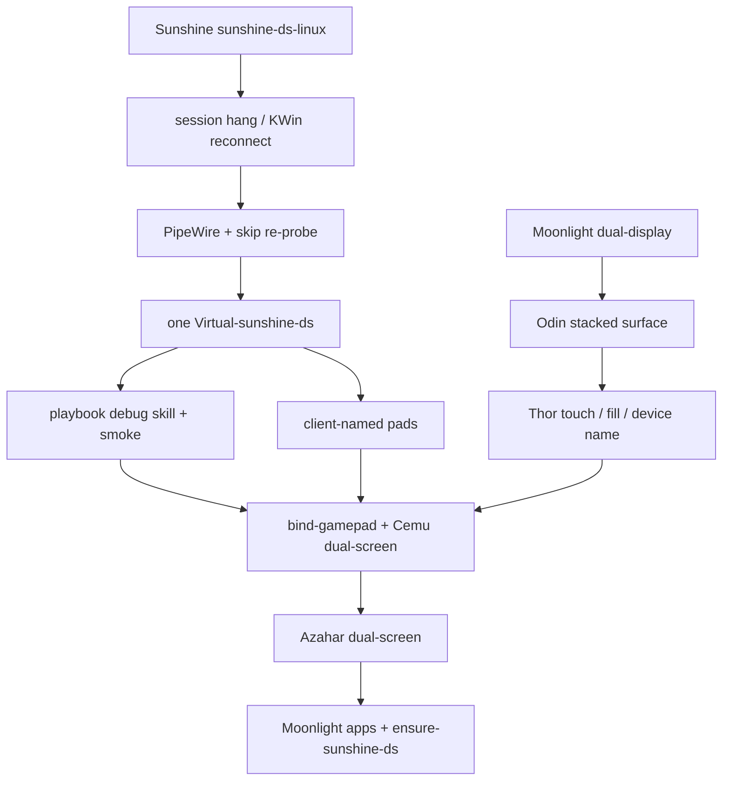

# sunshine-ds checkpoint and stack

Proven dual-stream GameStream as of 2026-09-08. Personal IPs/uniqueids stay in `host.md` / `rules_of_the_land.md`.

## Checkpoint SHAs

| Repo | Integration branch | Tip | Tag |
|---|---|---|---|
| [FanGoH/Sunshine](https://github.com/FanGoH/Sunshine) | `sunshine-ds-linux` | `0381303a` | `checkpoint-2026-09-08-one-virtual-output` |
| [FanGoH/moonlight-android](https://github.com/FanGoH/moonlight-android) | `dual-display` | `87267c9a` | `checkpoint-2026-09-08-device-name` |
| This playbook | `main` | this tree | `checkpoint-2026-09-08-sunshine-ds-playbook` |

Do not land DS Linux work on LizardByte `master` or Moonlight-stream `master`. Those remotes stay upstream.

## Host layout (do not rediscover)

- Decky Sunshine `:47989` (KMS). Dev sunshine-ds `:48100` (`capture = kwin`). Pin clients to `:48100`.
- Exactly one `Virtual-sunshine-ds` at 1920×1080, HDMI-A-1 at 0,0. Distrobox `steamos-tools`. `gamepad = x360`.
- Dual-stream is Plasma/KWin only. Game Mode is gamescope — tear DS down first (`scripts/switch-to-game-mode.sh` / Desktop **Return to Game Mode**).

## Logical order that got here

### FanGoH/Sunshine (`sunshine-ds-linux` ← these branches, already linear)

1. `cursor/sunshine-session-hang-f15e` — stay alive on dual-display teardown
2. `cursor/pair-duplicate-cert-f15e` — re-pair the same Moonlight cert
3. `cursor/pipewire-connect-f15e` — PipeWire links, skip software re-probe, no KWin cap drop (`checkpoint-steamos-kwin-reconnect`)
4. `cursor/kwin-virtual-f15e` — hold Virtual-sunshine-ds after KWin 6.7 “Could not find output”
5. `cursor/virtual-match-client-f15e` / `virtual-no-steal-f15e` — helper must not inherit INET sockets; do not steal Thor’s GamePad output
6. `cursor/gamepad-client-name-f15e` — pad name `Sunshine (libvirtualhid) <client>`
7. `cursor/disconnect-enet-f15e` — ENet null host, helper must not hold `:48100`
8. `cursor/reuse-virtual-output-f15e` — **checkpoint**: one helper across connect/disconnect, never spawn a second `--name sunshine-ds`

### FanGoH/moonlight-android (`dual-display` ← these branches)

1. `cursor/rtp-submit-stream1-f15e` — GamePad-only for Odin
2. `cursor/dual-touch-absolute-f15e` — absolute touch on both streams
3. `cursor/quit-dual-presentation-f15e` / `top-touch-hit-test-f15e` / `restore-bottom-presentation-f15e`
4. `cursor/stacked-secondary-surface-f15e` — **Odin stacked** (`checkpoint-odin-stacked-dual-stream` / `f4eca72d`)
5. `cursor/gamepad-fullscreen-layouts-f15e` / `second-screen-fill-f15e`
6. `cursor/device-name-f15e` — `AYN_Thor` / `Odin2_Portal` as GameStream `devicename`

### This playbook (supersedes overlapping PRs 14–21)

1. Debug skill, smoke HTML, Distrobox build helpers, last-resort KWin FBO helper
2. `bind-gamepad.py` + Cemu dual-screen
3. Azahar dual-screen
4. Moonlight apps, pad profiles, Quit game
5. `ensure-sunshine-ds.sh`, Game Mode teardown, Desktop shortcut

Pre-split snapshot: `refs/backup/checkpoint-20260908-gamestream-apps` (`2d45844`).
