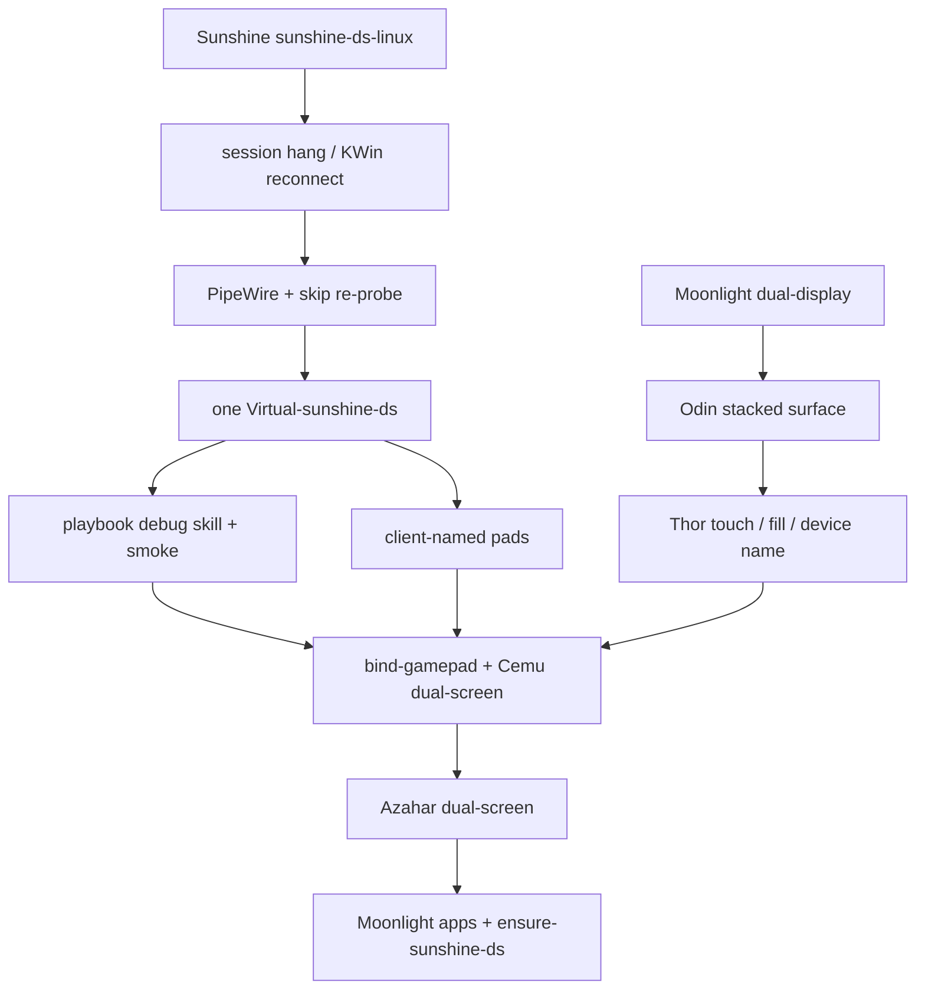

# sunshine-ds checkpoint and stack

Proven dual-stream GameStream as of 2026-09-08. Personal IPs/uniqueids stay in `host.md` / `rules_of_the_land.md`.

## Checkpoint SHAs

| Repo | Integration branch | Tip | Tag |
|---|---|---|---|
| [FanGoH/Sunshine](https://github.com/FanGoH/Sunshine) | `sunshine-ds-linux` | `0381303a` | `checkpoint-2026-09-08-one-virtual-output` |
| [FanGoH/moonlight-android](https://github.com/FanGoH/moonlight-android) | `dual-display` | `87267c9a` | `checkpoint-2026-09-08-device-name` |
| This playbook | `main` | this tree | `checkpoint-2026-09-08-sunshine-ds-playbook` |

Do not land DS Linux work on LizardByte `master` or Moonlight-stream `master`. Those remotes stay upstream.

## Host layout (do not rediscover)

- Decky Sunshine `:47989` (KMS). Dev sunshine-ds `:48100` (`capture = kwin`). Pin clients to `:48100`.
- Exactly one `Virtual-sunshine-ds` at 1920×1080, HDMI-A-1 at 0,0. Distrobox `steamos-tools`. `gamepad = x360`.
- Dual-stream is Plasma/KWin only. Game Mode is gamescope — tear DS down first (`scripts/switch-to-game-mode.sh` / Desktop **Return to Game Mode**).

## Game Mode KMS experiment (isolated)

Do **not** change `sunshine-ds-dev` (`capture = kwin`, `:48100`). The experiment uses a copy of the binary named `sunshine-ds-kms`, config dir `~/.config/sunshine-ds-gamemode`, and HTTP `:48200`. Not hooked into `post-update.sh`. Headless gamescope for video/1: `scripts/sunshine-ds-gamemode-virtual.sh` (not the KWin `sunshine-ds-virtual-output` helper).

```bash
scripts/ensure-sunshine-ds-gamemode.sh --probe   # start, print KMS log, stop
scripts/ensure-sunshine-ds-gamemode.sh --status
scripts/ensure-sunshine-ds-gamemode.sh --stop
```

2026-09-08: Distrobox uid 1000 can open `/dev/dri/card*` (ACL) but **cannot gain `CAP_SYS_ADMIN`** (`CapEff` 0 even with `--privileged` / file caps — user namespace). Host `setcap cap_sys_admin+ep` on `sunshine-ds-kms` is required. File caps set `AT_SECURE`, so `ld.so` **ignores `LD_LIBRARY_PATH`** (`ldd` with that env is not the execute path). Exit 127 `libminiupnpc.so.19` on a `nohup` with `LD_LIBRARY_PATH` is that, not a missing copy. Fix: RUNPATH `$HOME/.local/lib/sunshine-ds-kms` plus staged Fedora sonames. `patchelf --set-rpath` **strips** file caps — re-`setcap` the kms copy only. Never `setcap` `sunshine-ds`. Launch on the **host**, not Distrobox. Dual-stream Game Mode is still a separate problem after KMS enumerates a plane.

`--start` refuses unless `gamescope-session` is up. This worker must not `steamosctl switch-to-game-mode`. After patchelf / a fresh copy:

```bash
sudo setcap cap_sys_admin+ep ~/.local/bin/sunshine-ds-kms
getcap ~/.local/bin/sunshine-ds-kms
# no LD_LIBRARY_PATH
export XDG_RUNTIME_DIR=/run/user/$(id -u)
./scripts/ensure-sunshine-ds-gamemode.sh --start
curl -s --max-time 3 http://127.0.0.1:48200/serverinfo | grep -E 'state|uniqueid'
```

Moonlight: host `:48200` (pair again if uniqueid is new). Not `:48100`, not Decky `:47989`. If KMS still logs `Probably not permitted` with non-zero `CapEff`, Decky `:47989` may already hold the DRM fb — stop Decky Sunshine for the experiment only, do not uninstall it.

2026-09-09 host start in Game Mode: `getcap` `cap_sys_admin=ep`, pid stayed up, `/serverinfo` `FREE`, `MaxVideoStreams 1`. Log: `Screencasting with KMS`, `Mapped 'HDMI-A-1' to kmsgrab monitor index 0`, `Found monitor for DRM screencasting`, `Found H.264 encoder: libx264 [software]`. `CapPrm` still `0000000000200000` (SYS_ADMIN); `CapEff` 0 is Sunshine dropping caps after init, not the Distrobox failure. `CAP_SYS_NICE` EGL warning is noise. Startup I-frames ~1KB are `dummy_img()` — ignore until a live Moonlight stream.

2026-09-09 Moonlight DS on `:48200` **saw gamescope**: `New streaming session started`, KMS `HDMI-A-1`, software `libx264` at 7.3 Mbps target. Live encode (not dummy): I-frame ~17KB, ~1500 P-frames ~6KB, ~3 Mbps. Disconnect logs `Dropped DRM master` on `card1`; a later session still went `BUSY`. Single-stream Game Mode KMS is proven.

2026-09-09 **duplicate HDMI** as video/1 (`dual_display_source = HDMI-A-1`): `/serverinfo` `MaxVideoStreams 2`. User confirmed both Moonlight surfaces showed the TV. Do **not** set `virtual` here — that spawns `sunshine-ds-virtual-output` for KWin.

2026-09-09 **headless gamescope virtual**: `gamescope --backend headless` (isolated `env -u WAYLAND_DISPLAY -u DISPLAY`) publishes PipeWire `Video/Source` on `gamescope-1` / Xwayland `:2`. Session gamescope has no `zkde_screencast_unstable_v1`. `--smoke` captured a 1920×1080 blue PNG from that node. KMS cannot see the plane. sunshine-ds `dual_display_source = gamescope-virtual` attaches video/1 to the sidecar `$XDG_RUNTIME_DIR/sunshine-ds-gamemode-virtual`. Start kms with `WAYLAND_DISPLAY=gamescope-1` (or `gamescope-0`); `wayland-0` does not exist in Game Mode and pwgrab used to die in `get_dmabuf_modifiers` before attaching. Daily Thor/Odin dual-screen stays Plasma `:48100`.

2026-09-09 **Game Mode video/1 pitch black** after pwgrab attached: log `cpu frame type=2` `nonzero=8294400/8294400` (blue MemFd) then video/1 I-frame ~1KB / 0% coded. Encoder started from `dummy_img()` zeros; a static gamescope surface does not send another PipeWire buffer after the software DMA-BUF probe consumed the first. sunshine-ds `pipewire.cpp` must copy the last CPU frame into dummy and re-present it on snapshot timeout. Solid blue can stay a tiny I-frame (`pixel_diffs=0`); the bottom Moonlight surface must not be black. Verify with an ADB screenshot, not I-frame size.

2026-09-09 after `setcap` + `--start` of `f942497b`: two Moonlight connects still encoded video/1 `coded … 0.0%` with **no** `cpu frame type=2`. The helper’s static blue window had already gone silent. `scripts/sunshine-ds-gamemode-virtual.sh --start` now paints a moving yellow square on `:2` so gamescope keeps emitting.

2026-09-09 **user confirmed** Game Mode dual-stream smoke on `:48200`: “I SEE THE SMALL SQUARE MOVING IN A BLUE SCREEN.” Log `cpu frame type=2` `nonzero=8268800/8294400` `pixel_diffs=6400`; video/1 `coded y,uvDC intra: 0.4% 7.9%` (chroma present, not dummy black); HDMI still ~17KB I-frames. Daily Thor/Odin dual-screen stays Plasma `:48100`. Do not merge this experiment into play yet. Next content on video/1 is Cemu GamePad via `scripts/ensure-cemu-gamemode-dual-screen.sh` (SteamLaunch + `ffplay` `x11grab` onto `:2`), not KWin placement.

## Game Mode Cemu GamePad touch (2026-09-09)

User confirmed Wind Waker GamePad taps on sunshine-ds-kms `:48200` (uniqueid `1075C8EF…`). Do not “improve” stacked/Thor dual-stream mapping unless this breaks. Daily Plasma dual-screen stays `:48100`.

| Client | Layout | GamePad touch |
|---|---|---|
| Odin 2 Portal | **Stack both** (Auto) | works |
| AYN Thor | **dual-panel** | works |
| Odin 2 Portal | **GamePad only** | no reaction at `1dfeb53c` (display 0). Post-checkpoint host commit routes `primary_from_secondary` the same as display 1. |

| Repo | Branch | Tip | Tag |
|---|---|---|---|
| [FanGoH/Sunshine](https://github.com/FanGoH/Sunshine) | `cursor/gamemode-pw-virtual-f15e` | `1dfeb53c` | `checkpoint-2026-09-09-gamemode-cemu-touch` |
| This playbook | `cursor/ds-gamemode-kms-f15e` | this tree | `checkpoint-2026-09-09-gamemode-cemu-touch` |
| [FanGoH/moonlight-android](https://github.com/FanGoH/moonlight-android) | `dual-display` | `87267c9a` | unchanged (`checkpoint-2026-09-08-device-name`) |

Host: `~/.local/bin/sunshine-ds-kms` `cap_sys_admin=ep`, RUNPATH `~/.local/lib/sunshine-ds-kms`. Conf `capture = kms`, `dual_display_source = gamescope-virtual`. Cemu TV + GamePad stacked at session `:0` `0,0`; ffplay mirrors GamePad onto headless `:2`. Overlay is GDS `STEAM_OVERLAY` on HOME. Fangoh Moonlight GamePad fingers are absolute mouse (native LI_TOUCH off). kms unsets `$DISPLAY`; inject opens `:0`, warps onto GamePad View, then uinput-clicks at that cursor.

```bash
# After overwriting the ELF (clears file caps):
sudo setcap cap_sys_admin+ep ~/.local/bin/sunshine-ds-kms
./scripts/ensure-sunshine-ds-gamemode.sh --start
```

## Logical order that got here



### FanGoH/Sunshine (`sunshine-ds-linux` ← these branches, already linear)

1. `cursor/sunshine-session-hang-f15e` — stay alive on dual-display teardown
2. `cursor/pair-duplicate-cert-f15e` — re-pair the same Moonlight cert
3. `cursor/pipewire-connect-f15e` — PipeWire links, skip software re-probe, no KWin cap drop (`checkpoint-steamos-kwin-reconnect`)
4. `cursor/kwin-virtual-f15e` — hold Virtual-sunshine-ds after KWin 6.7 “Could not find output”
5. `cursor/virtual-match-client-f15e` / `virtual-no-steal-f15e` — helper must not inherit INET sockets; do not steal Thor’s GamePad output
6. `cursor/gamepad-client-name-f15e` — pad name `Sunshine (libvirtualhid) <client>`
7. `cursor/disconnect-enet-f15e` — ENet null host, helper must not hold `:48100`
8. `cursor/reuse-virtual-output-f15e` — **checkpoint**: one helper across connect/disconnect, never spawn a second `--name sunshine-ds`

### FanGoH/moonlight-android (`dual-display` ← these branches)

1. `cursor/rtp-submit-stream1-f15e` — GamePad-only for Odin
2. `cursor/dual-touch-absolute-f15e` — absolute touch on both streams
3. `cursor/quit-dual-presentation-f15e` / `top-touch-hit-test-f15e` / `restore-bottom-presentation-f15e`
4. `cursor/stacked-secondary-surface-f15e` — **Odin stacked** (`checkpoint-odin-stacked-dual-stream` / `f4eca72d`)
5. `cursor/gamepad-fullscreen-layouts-f15e` / `second-screen-fill-f15e`
6. `cursor/device-name-f15e` — `AYN_Thor` / `Odin2_Portal` as GameStream `devicename`

### This playbook (supersedes overlapping PRs 14–21)

1. Debug skill, smoke HTML, Distrobox build helpers, last-resort KWin FBO helper
2. `bind-gamepad.py` + Cemu dual-screen
3. Azahar dual-screen
4. Moonlight apps, pad profiles, Quit game
5. `ensure-sunshine-ds.sh`, Game Mode teardown, Desktop shortcut

Pre-split snapshot: `refs/backup/checkpoint-20260908-gamestream-apps` (`2d45844`).
